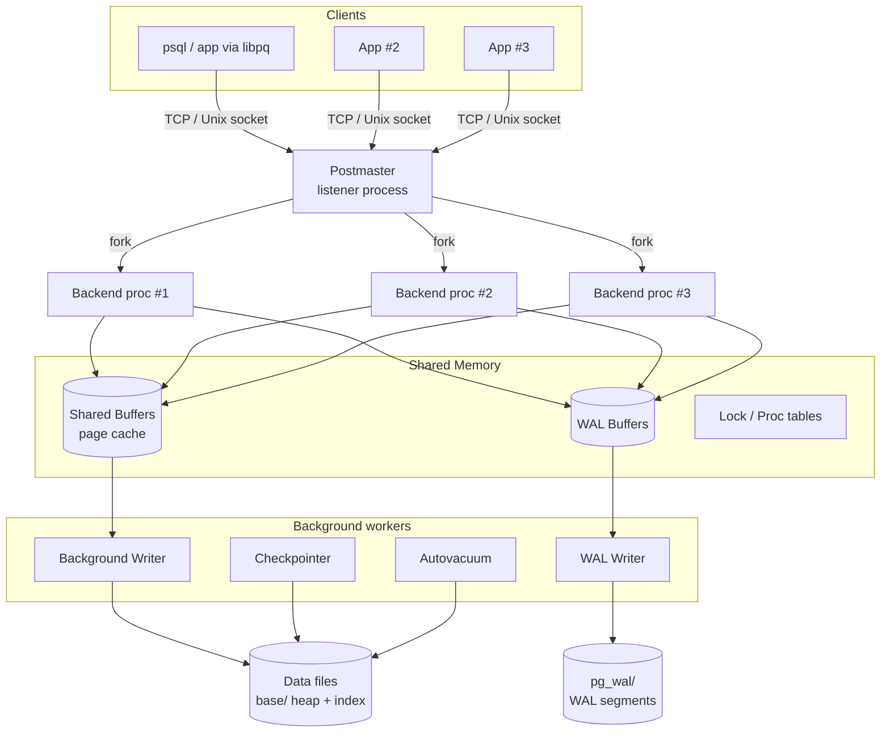
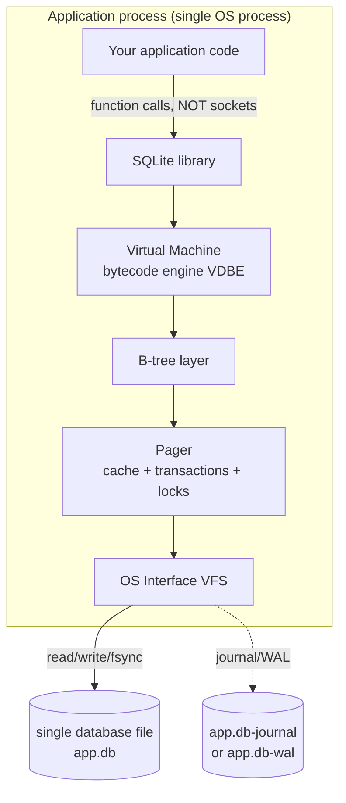

# PostgreSQL vs SQLite — An Architectural Comparison

> **Author:** Snehangshu Roy (24BCS10155)
> **Course:** Advanced DBMS — System Design Discussion
> **Topic 1:** PostgreSQL vs SQLite Architecture Comparison

---

## Table of Contents
1. [Problem Background](#1-problem-background)
2. [Architecture Overview](#2-architecture-overview)
3. [Internal Design](#3-internal-design)
4. [Design Trade-Offs](#4-design-trade-offs)
5. [Experiments / Observations](#5-experiments--observations)
6. [Key Learnings](#6-key-learnings)
7. [References](#references)

---

## 1. Problem Background

Both PostgreSQL and SQLite are relational databases that speak SQL, are ACID-compliant,
and store data in B-tree structures. Yet they sit at **opposite ends of the database design
spectrum**, because they were built to solve fundamentally different problems.

| | **PostgreSQL** | **SQLite** |
|---|---|---|
| Born | 1986, UC Berkeley (POSTGRES project, Michael Stonebraker) | 2000, D. Richard Hipp (originally for a US Navy missile destroyer's onboard software) |
| Problem it solves | A **server** that many concurrent clients can safely share, with rich types, extensibility and strong durability for OLTP/analytical workloads | An **embedded** SQL engine that an application links directly into its own process — "SQLite is not a replacement for Oracle, it is a replacement for `fopen()`" |
| Mental model | A standalone *service* you connect to over a socket | A *library* (a `.c`/`.h` you compile in) that reads/writes one file |
| Deployment unit | A running daemon + a data directory | A single `.db` file + a few hundred KB of linked code |

The central design question each answers differently:

> **"Who owns the data, and how many writers can touch it at once?"**

PostgreSQL assumes **a central authority (the server) mediates access for many remote
clients**. SQLite assumes **the application itself is the only thing touching the file**, so
it removes the server entirely. Almost every architectural difference below follows from this
single decision.

---

## 2. Architecture Overview

### 2.1 PostgreSQL — Client/Server, Process-per-Connection



- The **postmaster** listens on a port. For **every** new client connection it `fork()`s a
  dedicated **backend process**. One connection = one OS process.
- All backends share a single block of **shared memory** (`shared_buffers`, WAL buffers, lock
  tables). This shared region is what allows isolated processes to cooperate and see a
  consistent view of cached pages.
- A fleet of **background processes** (checkpointer, background writer, WAL writer, autovacuum)
  handles durability and cleanup asynchronously so client backends stay responsive.

### 2.2 SQLite — Embedded, In-Process Library



There is **no server, no socket, no separate process, no IPC**. SQLite is a stack of C
modules compiled *into* the application:

1. **SQL Compiler** → tokenizer → parser → code generator, producing bytecode.
2. **Virtual Machine (VDBE)** → executes that bytecode; this is the "CPU" of SQLite.
3. **B-tree** → tables and indexes are B-trees of pages.
4. **Pager** → page cache, transactions, locking, rollback/WAL journaling.
5. **OS Interface (VFS)** → the one place that touches the filesystem; swappable per platform.

A query is a **function call** (`sqlite3_step`) inside your process, not a network round-trip.

### 2.3 Data flow at a glance

| Step | PostgreSQL | SQLite |
|---|---|---|
| Issue query | Send SQL string over socket to backend | Call C API in-process |
| Parse + plan | Backend parses, cost-based planner picks plan | Compiler emits VDBE bytecode (rule-ish + some cost heuristics) |
| Execute | Executor pulls pages via shared buffers | VDBE drives B-tree via pager cache |
| Read page | Shared buffers (shared across all backends) | Per-connection page cache |
| Return | Rows streamed back over socket | Rows returned by function call |

---

## 3. Internal Design

### 3.1 Storage engine & file organization

**SQLite — one file is the entire database.**
The whole database (schema, every table, every index, the free list) lives in a **single
file**, structured as an array of fixed-size **pages** (default 4096 bytes; power of 2 from
512 B to 64 KB). Page 1 begins with the 100-byte header whose magic string is literally
`"SQLite format 3\000"`. Each table and each index is a separate B-tree rooted at some page;
`sqlite_schema` (page 1) maps names → root pages. This is verified directly in
[§5](#5-experiments--observations): a demo DB came out to exactly *582 pages × 4096 B = the
file size, to the byte.*

```
SQLite file = [ page 1 (header + sqlite_schema) ][ page 2 ]...[ page N ]
                  each page belongs to exactly one B-tree (a table or an index)
```

**PostgreSQL — a directory of many files.**
A cluster is a directory (`PGDATA`). Each table/index is stored in the `base/<db_oid>/`
directory, and **each relation is itself split into 1 GB segment files**. A table is a *heap*
— an unordered collection of 8 KB pages (the default `BLCKSZ`). Page layout:

```
8KB heap page:
+-----------------------------------------------------------+
| PageHeader | ItemId array -->                             |
|            (line pointers, grow downward)                 |
|                                                           |
|                          <-- free space -->               |
|                                                           |
|             <-- tuples grow upward (heap tuples)          |
| tuple_N ............................................ tuple_1|
| (special space, e.g. for index pages)                     |
+-----------------------------------------------------------+
```

The **ItemId / line-pointer** indirection is important: an index points at a line pointer,
not directly at a tuple's byte offset, so a tuple can be moved within its page (e.g. by
`HOT` updates / pruning) without rewriting every index.

> **Key structural difference:** SQLite tables are **clustered** — the table *is* a B-tree
> keyed by `rowid`/`INTEGER PRIMARY KEY`, so rows live in key order inside leaf pages.
> PostgreSQL tables are **heaps** — rows are stored wherever there is room, and *all* indexes
> (even the primary key) are secondary structures pointing into the heap. (This is also the
> big contrast with MySQL/InnoDB, which clusters like SQLite but logs like nobody else.)

### 3.2 Index implementation
- Both default to **B+-tree** indexes. SQLite's primary table is itself a B-tree; secondary
  indexes are separate B-trees whose leaves store the indexed columns + the rowid.
- PostgreSQL ships many index types (**B-tree, Hash, GiST, SP-GiST, GIN, BRIN**) and supports
  partial, expression, and covering (`INCLUDE`) indexes. SQLite supports partial and
  expression indexes too, but a far smaller set of access methods.
- Because PostgreSQL heaps are unordered, a B-tree index leaf stores a **TID** `(block, offset)`
  pointing into the heap; the executor must then do a heap fetch (unless an *index-only scan*
  is possible and the visibility map says the page is all-visible).

### 3.3 Memory management
- **PostgreSQL:** a large **`shared_buffers`** pool (typically 25% of RAM) is shared by all
  backends. Pages are read into this pool; a clock-sweep replacement algorithm
  (`usage_count`) chooses victims. Dirty pages are flushed by the background writer and at
  checkpoints, *not* synchronously by the query that dirtied them.
- **SQLite:** each connection has its own modest **page cache** (`PRAGMA cache_size`,
  default ~2 MB). There is no cross-process shared cache (except the optional shared-cache
  mode / `mmap`). This is fine because the working set of an embedded app is usually small.

### 3.4 Transaction management, concurrency & MVCC

This is where the two architectures diverge the most.

**PostgreSQL — true MVCC via tuple versioning.**
Every row version (heap tuple) carries hidden system columns `xmin` (the transaction that
created it) and `xmax` (the transaction that deleted/updated it). An `UPDATE` does **not**
overwrite the row — it writes a **new tuple version** and marks the old one's `xmax`. Each
transaction takes a **snapshot**; visibility rules compare a tuple's `xmin`/`xmax` against
that snapshot to decide what the transaction can see.

```
UPDATE row id=7 SET v=200 (old v=100):

  before:  (xmin=10, xmax=0,  id=7, v=100)   <- visible to old snapshots
  after :  (xmin=10, xmax=42, id=7, v=100)   <- now "deleted" by txn 42
           (xmin=42, xmax=0,  id=7, v=200)   <- new version, visible to txn>=42
```

Consequences:
- **Readers never block writers and writers never block readers.** A reader just sees the
  version valid for its snapshot.
- Dead tuples accumulate → **`VACUUM`** is required to reclaim space and (critically) to
  prevent **transaction-ID wraparound**. `autovacuum` does this in the background.
- Row-level locks for writers; a rich set of explicit lock modes; Serializable Snapshot
  Isolation (SSI) for true serializability.

**SQLite — database-level (or page-level via WAL) locking.**
SQLite's concurrency model is much simpler:
- In the classic **rollback-journal** mode, a writer takes an **EXCLUSIVE lock on the whole
  database file** — only one writer at a time, and writers block readers during the write.
- In **WAL mode** (`PRAGMA journal_mode=WAL`), **readers and one writer can proceed
  concurrently**: readers continue reading the original DB file while the writer appends to
  the `-wal` file. But there is still only ever **one writer at a time**.
- SQLite implements snapshot isolation in WAL mode, but it is *not* a multi-version,
  multi-writer engine like PostgreSQL. The unit of contention is the whole database, not the
  row.

### 3.5 Durability & recovery

| | PostgreSQL (WAL) | SQLite |
|---|---|---|
| Mechanism | Write-Ahead Log: changes logged to `pg_wal/` **before** data pages are flushed | Two modes: **rollback journal** (default) or **WAL** |
| Rollback journal | — | Copies *original* pages into `<db>-journal` before modifying them; on crash, originals are copied back |
| WAL | Redo log; recovery replays WAL from last checkpoint | Appends *new* pages to `<db>-wal`; checkpoint folds them back into the main file |
| Checkpoint | Periodic; bounds recovery time, lets WAL be recycled | `PRAGMA wal_checkpoint`; folds WAL pages into the DB |
| Commit guarantee | `fsync` of WAL record (tunable via `synchronous_commit`) | `fsync` of journal/WAL + DB per the `synchronous` pragma |
| Group commit / streaming | Yes — WAL also powers **streaming replication & PITR** | No built-in replication; durability is local-file only |

Both are **write-ahead in spirit**: never let a data page reach disk representing a change
that isn't already durably recorded somewhere it can be recovered from.

---

## 4. Design Trade-Offs

### 4.1 Why SQLite chose to be embedded
- **Zero configuration / zero administration.** No server to install, start, secure, or tune.
- **No IPC overhead.** A query is a function call, not a socket round-trip — superb latency
  for local reads.
- **Portability.** The entire database is one file you can copy, email, or check into git.
- **Tiny footprint.** ~½ MB of code, runs in constrained environments.

**Cost:** because there is no server arbitrating access, **concurrent writes from multiple
processes are serialized at the file level**. SQLite explicitly trades multi-writer
concurrency for radical simplicity. It is the wrong tool for a high-write, many-client OLTP
backend — and the docs say so.

### 4.2 Why PostgreSQL chose client/server
- **Many concurrent clients** need a central authority to coordinate locks, buffers, and
  visibility — that authority is the server + shared memory.
- **Strong, row-level MVCC** lets thousands of transactions run with minimal blocking.
- **Extensibility & rich features** (types, indexes, procedural languages, replication,
  parallel query) are practical when there's a long-lived server process to host them.

**Cost:** operational weight. You must run, secure, back up, and tune a daemon. Each
connection is a full OS process, so thousands of idle connections are expensive — hence the
near-universal use of **connection poolers (PgBouncer)**. The MVCC model also creates **bloat**
and a hard dependency on `VACUUM`.

### 4.3 The process-per-connection trade-off
PostgreSQL's `fork()`-per-connection gives strong **isolation and crash containment** (one
backend segfaulting doesn't take down others) at the cost of **per-connection memory and
context-switch overhead**. Threaded designs (e.g. MySQL) trade some isolation for lighter
connections; PostgreSQL leans on pooling instead.

### 4.4 Clustered (SQLite) vs heap (PostgreSQL) storage
- Clustered tables give SQLite **fast primary-key range scans** (rows are physically in key
  order) and avoid a separate heap fetch for PK lookups.
- PostgreSQL's heap makes **updates cheap to relocate** and keeps *all* indexes symmetric, but
  every index lookup pays a heap-fetch + visibility check, and physical order drifts from any
  index (mitigated by `CLUSTER`, which is a one-shot reorganization, not maintained).

### 4.5 Scalability implications
| Dimension | SQLite | PostgreSQL |
|---|---|---|
| Read concurrency | Excellent (esp. WAL mode) | Excellent (MVCC) |
| Write concurrency | **One writer at a time** | High (row-level MVCC) |
| Data size | Great up to ~GBs; works into TBs but rarely the right call | Designed for large multi-TB datasets |
| Clients | Single application/process (or few via WAL) | Thousands (with pooling) |
| Horizontal scale | None built in | Replication, logical decoding, partitioning, FDW |

---

## 5. Experiments / Observations

All SQLite experiments below were **run live** with `sqlite3 3.50.6`. PostgreSQL plans are
**representative** (no live server was available in this environment) and clearly marked.

### 5.1 The whole database really is one file of fixed-size pages
Created a demo DB with 5,001 authors and 50,000 books:

```sql
PRAGMA page_size;   -- 4096
PRAGMA page_count;  -- 582
SELECT count(*) FROM books;    -- 50000
SELECT count(*) FROM authors;  -- 5001
```
File size on disk: **2,383,872 bytes**, and `582 × 4096 = 2,383,872` — **exactly**. This
confirms the architectural claim that a SQLite database is literally an array of equal-sized
pages in a single file. The file's first 16 bytes are the magic string `SQLite format 3\0`.

### 5.2 The planner uses indexes — observed via `EXPLAIN QUERY PLAN`
**Before** creating any index on `books.author_id` / `books.year`, the join falls back to a
**full table scan** of `books`:

```
EXPLAIN QUERY PLAN
SELECT a.name, COUNT(*) FROM authors a
JOIN books b ON b.author_id = a.id
WHERE b.year > 2000 GROUP BY a.name;

|--SCAN b                                       <-- full scan of 50k rows
|--SEARCH a USING INTEGER PRIMARY KEY (rowid=?)
`--USE TEMP B-TREE FOR GROUP BY
```

**After** `CREATE INDEX idx_books_year(year)` and `idx_books_author(author_id)`, the same
query switches to an **index range search**:

```
|--SEARCH b USING INDEX idx_books_year (year>?)   <-- index range scan, no full scan
|--SEARCH a USING INTEGER PRIMARY KEY (rowid=?)
`--USE TEMP B-TREE FOR GROUP BY
```

A point lookup on the clustered primary key needs **no secondary index at all** — it searches
the table's own B-tree directly:

```
EXPLAIN QUERY PLAN SELECT * FROM books WHERE id = 42424;
`--SEARCH books USING INTEGER PRIMARY KEY (rowid=?)
```
This is the clustered-table property from [§3.1](#31-storage-engine--file-organization) in
action: `INTEGER PRIMARY KEY` *is* the rowid, so the table B-tree itself is the index.

### 5.3 Journaling modes change which sidecar files appear
```sql
PRAGMA journal_mode;          -- delete   (default rollback journal)
PRAGMA journal_mode = WAL;    -- wal
```
In rollback mode, a transaction transiently creates `demo.db-journal`; in WAL mode it creates
`demo.db-wal` (+ `-shm` shared-memory index). After `PRAGMA wal_checkpoint`, the WAL contents
are folded back into `demo.db` and the sidecar shrinks. This is the on-disk evidence of the
two durability strategies in [§3.5](#35-durability--recovery).

### 5.4 Representative PostgreSQL `EXPLAIN ANALYZE` (illustrative)
On a comparable two-table join, a PostgreSQL plan would look like:

```
HashAggregate  (cost=... rows=5000 ...) (actual time=... rows=4983 ...)
  Group Key: a.name
  ->  Hash Join  (cost=... ) (actual time=...)
        Hash Cond: (b.author_id = a.id)
        ->  Bitmap Heap Scan on books b   (recheck, uses idx_books_year)
              Recheck Cond: (year > 2000)
              ->  Bitmap Index Scan on idx_books_year
        ->  Hash
              ->  Seq Scan on authors a
Planning Time: 0.4 ms
Execution Time: ... ms
```
The contrast worth noting: PostgreSQL's planner is **cost-based** and reports both *estimated*
and *actual* rows — estimates come from statistics collected by `ANALYZE` and stored in
`pg_statistic` (most-common-values, histograms, n_distinct). When estimates diverge wildly
from actuals, the planner picks bad plans — which is *why* keeping statistics fresh matters.
SQLite's planner is simpler (it uses `sqlite_stat1` from `ANALYZE` plus rules) and does not
print cost estimates in `EXPLAIN QUERY PLAN`.

---

## 6. Key Learnings

1. **One decision cascades into everything.** "Server vs. embedded" is not one feature among
   many — it *determines* the process model, the locking granularity, the concurrency story,
   the durability files, and the deployment unit. Architecture is a tree, and this is the root.

2. **SQLite competes with `fopen()`, not with PostgreSQL.** Judging SQLite by multi-writer
   throughput misses the point; judging PostgreSQL by "how easy to embed" misses the point.
   They optimize for different cost functions: SQLite minimizes *operational + latency cost*;
   PostgreSQL maximizes *concurrent correctness + feature reach*.

3. **MVCC is not free.** PostgreSQL buys lock-free reads with tuple versioning, and the bill
   arrives as dead-tuple **bloat** and a mandatory **`VACUUM`** subsystem. SQLite avoids that
   entire problem class by simply serializing writers — a smaller hammer for a smaller nail.

4. **Clustered vs heap storage is a real, observable trade-off.** I *saw* SQLite resolve a PK
   lookup with no secondary index because the table itself is the B-tree, whereas PostgreSQL
   would need an index + heap fetch + visibility check. Neither is "better" — they front-load
   cost in different places (PK reads vs. update flexibility).

5. **The file *is* the architecture.** The most striking confirmation was arithmetic:
   `582 pages × 4096 bytes = file size, exactly`. You can reason about a system's design just
   by measuring its bytes on disk.

6. **Both are write-ahead at heart.** PostgreSQL's WAL and SQLite's journal/WAL are different
   implementations of the same durability principle — never expose a change you can't recover.
   The difference is *scale of ambition*: PostgreSQL's WAL also powers replication and PITR,
   while SQLite's stays a local-recovery mechanism, by design.

---

## References
- SQLite — *Architecture of SQLite*, *Database File Format*, *Write-Ahead Logging*, *Appropriate Uses For SQLite* — https://www.sqlite.org/arch.html, /fileformat2.html, /wal.html, /whentouse.html
- PostgreSQL Documentation — *Database Page Layout*, *Storage*, *WAL*, *MVCC / Concurrency Control*, *Routine Vacuuming* — https://www.postgresql.org/docs/current/
- H. Garcia-Molina, J. Ullman, J. Widom — *Database Systems: The Complete Book* (storage, indexing, concurrency).
- Experiments in [§5](#5-experiments--observations) were run locally with `sqlite3` version 3.50.6.

*All analysis and write-up are my own original work. Sources above are credited per the assignment guidelines.*
