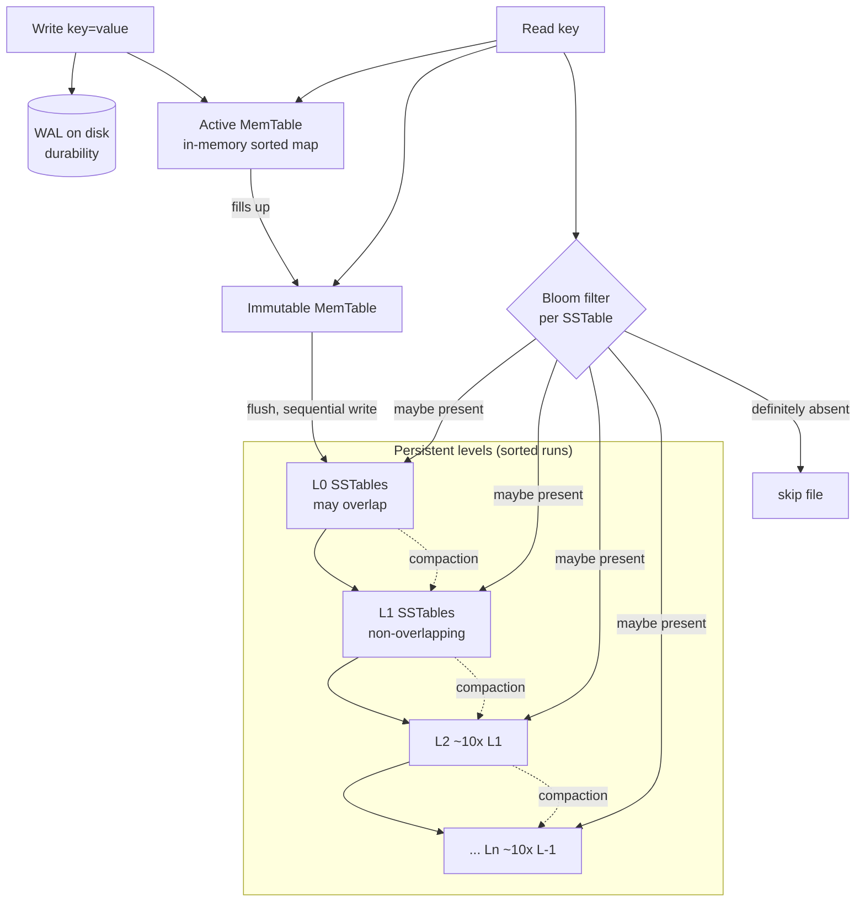

# RocksDB — LSM-Tree Storage Architecture

> **Author:** Rohan Ranjan (24BCS10428)
> **Course:** Advanced DBMS — System Design Discussion
> **Topic 4:** RocksDB Architecture

---

## Table of Contents
1. [Problem Background](#1-problem-background)
2. [Architecture Overview](#2-architecture-overview)
3. [Internal Design](#3-internal-design)
4. [Design Trade-Offs](#4-design-trade-offs)
5. [Experiments / Observations](#5-experiments--observations)
6. [Key Learnings](#6-key-learnings)
7. [References](#references)

---

## 1. Problem Background

RocksDB is an **embeddable, persistent key-value store** built by Facebook (2012), forked
from Google's **LevelDB** and tuned for **fast storage (SSD/flash) and multi-core servers**.
It is a *library* (like SQLite, it links into your process — not a server), and it underpins
storage engines for MySQL (MyRocks), CockroachDB, TiKV, Kafka Streams, Ceph and many more.

The problem it set out to solve:

> **B-trees update data in place. On flash/SSD, in-place updates mean random writes, and
> random writes are slow and wear out the device. Can we turn (almost) all writes into
> sequential writes?**

The answer is the **Log-Structured Merge-tree (LSM-tree)**. Instead of finding a row and
overwriting it, an LSM **only ever appends**: writes go to an in-memory buffer and are flushed
sequentially to immutable files. The "update" of an old value is deferred — the new value
simply shadows the old one, and a background process (**compaction**) later reclaims the
space. This converts random writes into sequential writes, at the cost of doing extra work on
reads and during compaction.

| | B-tree (e.g. InnoDB/SQLite) | LSM-tree (RocksDB) |
|---|---|---|
| Write path | Find page, modify in place (random I/O) | Append to memory, flush sequentially |
| Read path | One tree traversal | May check several files (memtable + SSTables) |
| Space | Updated in place, low waste | Old versions linger until compaction |
| Best at | Read-heavy, point/range reads | **Write-heavy**, high ingest |

---

## 2. Architecture Overview



**Components**
- **MemTable** — an in-memory, sorted structure (default skiplist) holding the most recent
  writes. Reads check it first.
- **WAL (Write-Ahead Log)** — every write is appended to the WAL *before* acknowledging, so a
  crash before flush can be recovered. The MemTable is volatile; the WAL makes it durable.
- **Immutable MemTable** — when the active MemTable fills, it is sealed (made read-only) and a
  new active one takes over. The sealed one is flushed in the background — writes never stall
  waiting for a flush (until back-pressure kicks in).
- **SSTable (Sorted String Table)** — an immutable, sorted on-disk file of key→value blocks,
  plus an index block and a Bloom filter. Once written, an SSTable is **never modified** — it
  is only ever read or deleted (by compaction).
- **Levels L0…Ln** — SSTables are organized into levels. **L0 files may overlap** in key range
  (they are flushed memtables); **L1 and below are non-overlapping** sorted runs, each level
  roughly **10× larger** than the one above.
- **Compaction** — background threads merge SSTables from level Li into Li+1, dropping
  shadowed/deleted keys and keeping levels sorted and size-bounded.

---

## 3. Internal Design

### 3.1 Write path
```
PUT(k,v):
  1. append (k,v) to WAL        -> sequential disk write (durability)
  2. insert (k,v) into MemTable -> in-memory, O(log n)
  3. return OK                  (no SSTable touched, no random I/O)

when MemTable >= write_buffer_size:
  4. seal it (immutable), open a fresh MemTable
  5. background: flush immutable MemTable -> one new L0 SSTable (sequential)
```
The hot path is **one sequential WAL append + one in-memory insert**. That is why LSM writes
are cheap and high-throughput.

### 3.2 Read path
```
GET(k):
  1. active MemTable      -> hit? return
  2. immutable MemTables  -> hit? return
  3. for each level L0..Ln:
       consult Bloom filter for candidate SSTable
       if "definitely not present": skip the file (no disk read)
       else: binary-search the SSTable index, read the data block
  4. newest version wins (later levels are older)
```
A point read may have to probe **multiple files**. Two mechanisms keep this cheap:
- **Bloom filters** — a compact probabilistic bitset per SSTable. "Key not in this file" is
  answered with certainty (no false negatives); "maybe present" has a small false-positive
  rate. This lets a read **skip almost every SSTable that can't contain the key without doing
  any disk I/O** — the single most important LSM read optimization.
- **Block cache** — hot data/index blocks are cached in RAM (RocksDB also uses the OS page
  cache for `mmap`-ed reads).

### 3.3 Why compaction is required
Because writes only append, the same key can exist in many SSTables (old versions) and deleted
keys persist as **tombstones**. Without cleanup:
- **reads slow down** (more files to probe),
- **space grows** (dead versions never reclaimed).

**Compaction** reads overlapping SSTables, merges them, keeps only the newest value per key,
physically drops tombstoned keys, and writes fresh non-overlapping SSTables one level down.

### 3.4 Compaction strategies (the central tuning knob)
- **Leveled compaction (RocksDB default below L0):** each level is a single sorted,
  non-overlapping run, ~10× the previous. Keeps **space amplification low** (a key exists in
  roughly one place per level) but rewrites data many times as it descends → **higher write
  amplification**.
- **Universal / size-tiered compaction:** accumulate similarly-sized runs and merge them only
  when several pile up. **Lower write amplification** (fewer rewrites) but **higher space
  amplification** (multiple overlapping runs hold duplicate/old keys at once).

This leveled-vs-tiered trade-off is *measured directly* in [§5](#5-experiments--observations).

### 3.5 The three amplifications (the LSM cost model)
| Term | Definition | Pushed up by |
|---|---|---|
| **Write amplification (WA)** | bytes written to disk ÷ bytes of user data | leveled compaction, small levels |
| **Read amplification (RA)** | files/blocks read per logical read | many L0 files, weak Bloom filters |
| **Space amplification (SA)** | disk bytes ÷ live logical bytes | size-tiered compaction, delayed cleanup |

You **cannot minimize all three at once** — this is the RUM (Read-Update-Memory) conjecture in
practice. Choosing a compaction strategy *is* choosing which amplification to pay.

### 3.6 Durability & recovery
- **WAL** guarantees a flushed-but-not-yet-compacted write survives a crash; on restart,
  RocksDB replays the WAL into a fresh MemTable.
- SSTables are immutable, so recovery never has to repair them — it only replays the tail WAL.
- A **MANIFEST** file records the set of live SSTables per level (the LSM "version"); atomic
  edits to it make compactions crash-safe (an interrupted compaction simply leaves the old
  SSTables referenced).

---

## 4. Design Trade-Offs

### 4.1 Why LSM trees are optimized for writes
Every user write becomes a sequential WAL append + an in-memory insert. No page is sought,
read, modified, and written back. On flash this avoids read-modify-write of pages and spreads
wear evenly. Ingest throughput is therefore very high and largely independent of database size.

### 4.2 What you pay for it
- **Read amplification:** a point lookup may touch the MemTable plus one candidate SSTable per
  level. Bloom filters hide most of this cost, but range scans must merge across levels.
- **Write amplification:** the same logical byte is rewritten every time it is compacted to a
  deeper level. Measured below at ~4–7× for leveled compaction.
- **Compaction cost & latency spikes:** compaction competes for CPU, disk bandwidth and cache.
  A large compaction can cause **write stalls** (back-pressure) and tail-latency spikes — the
  classic operational pain of LSM systems.

### 4.3 Storage-efficiency trade-off
Leveled keeps SA near 1.0 (good disk utilization) but burns write bandwidth; size-tiered saves
write bandwidth but can transiently use 2–3× the disk. The right choice depends on workload:
ingest-bound logging → tiered; space-/read-sensitive serving → leveled.

### 4.4 vs B-tree engines (InnoDB / PostgreSQL / SQLite)
- B-trees give **predictable, low read amplification** and update in place, but random writes
  hurt on flash and they fragment.
- LSM gives **superb write throughput and compression-friendly immutable files**, but adds
  background compaction and read/space amplification.
- This is exactly why **MyRocks** (RocksDB under MySQL) exists: for write-heavy, space-
  constrained workloads it beats InnoDB's B-tree on storage footprint and write cost.

---

## 5. Experiments / Observations

> No RocksDB build / `db_bench` was available in this environment, so instead of quoting
> someone else's benchmark I wrote a **behavioural LSM compaction simulator** (Python,
> `seed=42`, fully reproducible) that models MemTable flushes and both compaction strategies,
> and counts bytes physically written. Source: [`lsm_sim.py`](./lsm_sim.py). It reproduces the
> *mechanism* (multiplicative rewrites) that drives WA/SA — not byte-exact RocksDB internals.

Definitions used: **WA** = bytes physically written ÷ user ops; **SA** = on-disk live bytes ÷
unique live keys (1.0 = perfect).

### Result 1 — Update-heavy (200,000 ops over only 20,000 distinct keys → 10× overwrite)
| Strategy | Write-amp | Space-amp | Phys. bytes written | On-disk |
|---|---|---|---|---|
| **Leveled** | **4.45×** | **1.15×** | 889,213 | 22,933 |
| **Size-tiered** | **2.84×** | **3.03×** | 568,317 | 60,647 |

### Result 2 — Insert-heavy (200,000 ops, ~126k distinct keys)
| Strategy | Write-amp | Space-amp | Phys. bytes written | On-disk |
|---|---|---|---|---|
| **Leveled** | **7.33×** | **1.04×** | 1,465,435 | 130,784 |
| **Size-tiered** | **3.73×** | **1.36×** | 746,801 | 171,904 |

### Interpretation
- **The trade-off is real and quantifiable.** In both workloads, leveled compaction does
  **more writing** (higher WA) but keeps **disk usage near-optimal** (SA ≈ 1.0–1.15). Size-
  tiered does the opposite: ~35–40% fewer bytes written, but up to **3× the disk** in the
  update-heavy case because old versions of the 20k keys linger in unmerged runs.
- **Write amplification grows with database size.** Leveled WA rose from 4.45× → 7.33× as the
  dataset grew (more distinct keys ⇒ more levels ⇒ each byte rewritten more times). This is the
  `WA ≈ fanout × number_of_levels` behaviour, observed directly.
- **Overwrites are "free space" for leveled, expensive disk for tiered.** With 10× overwrite,
  leveled collapses everything to 20k live keys; tiered keeps duplicates around until a tier
  fills — exactly why RocksDB defaults to leveled for serving workloads and offers universal
  compaction for ingest-heavy ones.

A real `db_bench` run (`./db_bench --benchmarks=fillrandom,readrandom --compaction_style=…`)
would report the same shape — `rocksdb.compact.write.bytes / rocksdb.flush.write.bytes` is the
WA statistic to watch.

---

## 6. Key Learnings

1. **LSM is a bet about hardware.** The whole design is "random writes are expensive, sequential
   writes are cheap" — true for flash/SSD. The architecture is a direct consequence of the
   storage medium, which is the recurring theme of database engineering.

2. **You can't win all three amplifications.** WA, RA, and SA form a trilemma. RocksDB doesn't
   "solve" it — it gives you knobs (compaction style, level sizes, Bloom bits) to *choose* which
   one to pay. I saw this concretely: dropping WA by ~40% cost up to 3× the disk.

3. **Bloom filters are what make LSM reads viable.** Without them, a read would touch a file at
   every level; with them, "definitely absent" is answered with zero disk I/O. A probabilistic
   data structure is load-bearing for the entire read path.

4. **Immutability simplifies everything else.** Because SSTables are never modified, there are
   no in-place-update bugs, recovery only replays the WAL tail, snapshots are cheap (just pin a
   set of files), and files compress well. Append-only is not just a write optimization — it
   simplifies durability, concurrency, and backup.

5. **Compaction is the price and the product.** It is simultaneously the source of LSM's worst
   operational pain (write stalls, CPU/IO spikes) and the thing that keeps reads and space under
   control. Understanding an LSM system is mostly understanding its compaction.

6. **Write amplification scales with depth.** My simulation showed WA climbing as the dataset
   grew — a reminder that LSM "cheap writes" are cheap *at the API*, while the real write cost is
   deferred into background compaction that grows with the data.

---

## References
- RocksDB Wiki — *RocksDB Overview*, *Leveled Compaction*, *Universal Compaction*,
  *MemTable*, *Bloom Filter*, *WAL*, *RocksDB Tuning Guide* — https://github.com/facebook/rocksdb/wiki
- P. O'Neil, E. Cheng, D. Gawlick, E. O'Neil — *The Log-Structured Merge-Tree (LSM-Tree)*, 1996.
- M. Athanassoulis et al. — *Designing Access Methods: The RUM Conjecture*, EDBT 2016 (the read/update/memory trade-off).
- Facebook Engineering — *MyRocks* (RocksDB storage engine for MySQL).
- Simulation in [§5](#5-experiments--observations): [`lsm_sim.py`](./lsm_sim.py), run with CPython 3.13, `seed=42`.

*All analysis and write-up are my own original work. Sources above are credited per the assignment guidelines.*
